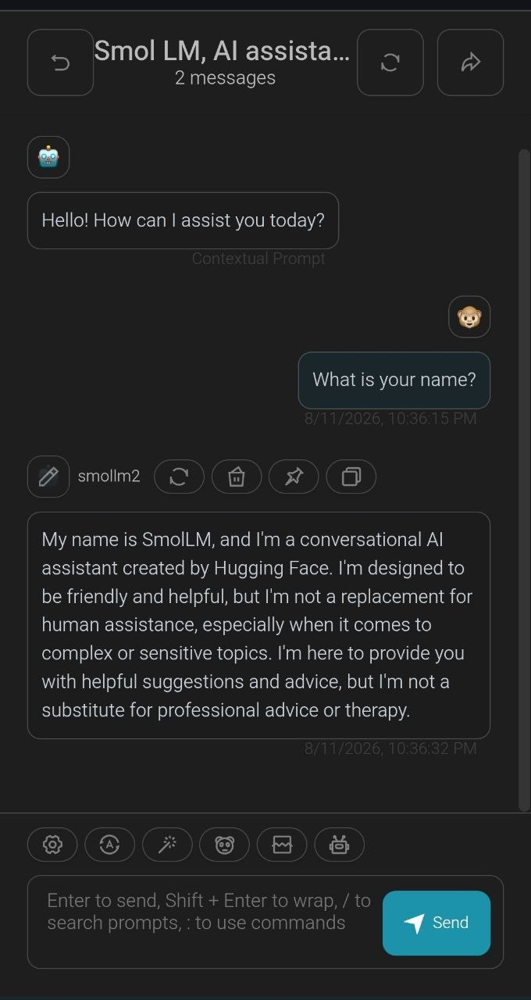

# SmolLM2 Demo

A didactic implementation of the LLaMA architecture with real weight loading
from HuggingFace. Built to study how a modern transformer works under the hood.

## Quick Start

```bash
git clone git@github.com:jmfvarela/smollm2-demo.git
cd smollm2-demo

# One command → API + Chat UI
docker compose up -d --build
```

Then open **http://localhost:3001** and start chatting.



Stop when done:
```bash
docker compose down
```

> ⚠️ First run downloads model weights from HuggingFace
> and takes 2-5 minutes (360M-Instruct: ~700 MB, 135M: ~270 MB).
> Subsequent starts are instant (cached).
>
> To use the smaller 135M model: `SMOLLM2_MODEL_ID=HuggingFaceTB/SmolLM2-135M docker compose up -d --build`

The API is at http://localhost:3000 if you want to call it directly:

```bash
curl http://localhost:3000/v1/chat/completions \
  -H "Content-Type: application/json" \
  -d '{"model":"smollm2","messages":[{"role":"user","content":"Hello"}]}'
```

## Models

Two SmolLM2 sizes are supported. The model architecture is **auto-detected**
from HuggingFace — no manual config needed for either.

| Model | Params | Size (bfloat16) | Download | RAM needed |
|---|---|---|---|---|
| `SmolLM2-360M-Instruct` | 360M | ~720 MB | ~700 MB | ~1.2 GB | Chat / instruct |
| `SmolLM2-135M` | 135M | ~270 MB | ~270 MB | ~550 MB | Base (completion only) |

> ⚠️ **135M is a base model** — it completes text but doesn't follow instructions.
> It will produce incoherent output in chat. Use 360M-Instruct for conversations.

**Docker (default):** `SmolLM2-360M-Instruct` — better quality, instruction-tuned.
**Standalone demo** (`python model.py`): `SmolLM2-135M` — faster, less RAM.

> 🌐 **Language:** Both models are primarily English. 360M-Instruct may
> understand simple Spanish but quality drops significantly. Chat in English
> for best results.

Switch via the `SMOLLM2_MODEL_ID` env var or `.env` file:
```bash
# Use 135M with Docker
SMOLLM2_MODEL_ID=HuggingFaceTB/SmolLM2-135M docker compose up -d --build

# Or copy .env.example to .env and edit
cp .env.example .env
# Change the MODEL_ID line, then: docker compose up -d --build
```

## Study the model (no Docker)

```bash
pip install -r requirements.txt
python model.py
```

## How weights are downloaded

The repo does **not include model weights**. They are
downloaded automatically from HuggingFace Hub on first run:

1. `AutoModelForCausalLM.from_pretrained(...)` → downloads weights, caches in `~/.cache/huggingface/`
2. `AutoTokenizer.from_pretrained(...)` → downloads tokenizer
3. `custom_model.load_state_dict(hf_model.state_dict())` → copies weights to our implementation. **No manual mapping** — same module names as HuggingFace.

Subsequent runs use local cache → no re-download.

## Files

| File | Purpose |
|------|---------|
| `model.py` | Full documented implementation (465 lines). Importable, runnable. |
| `server.py` | FastAPI with `/v1/chat/completions` (OpenAI-compatible) + SSE streaming |
| `Dockerfile` | Python 3.13 container with CPU-only Torch |
| `requirements.txt` | Python dependencies |
| `docker-compose.yml` | smollm2-seed + NextChat + optional nginx |
| `nginx.conf` | Reverse proxy config for the optional nginx service |

## Architecture

```
tokens → Embeddings → TransformerBlock × N → RMSNorm → lm_head → logits

N depends on the model (30 for 135M, 40 for 360M — auto-detected).

Each TransformerBlock:
  RMSNorm → Attention (GQA + RoPE + KV-Cache) → (+) residual
  RMSNorm → SwiGLU MLP → (+) residual
```

## Components

| Component | Detail |
|-----------|--------|
| Normalization | RMSNorm (no re-centering, faster than LayerNorm) |
| Positioning | RoPE (rotary, captures relative position) |
| Attention | GQA 9:3 with KV-cache (3× compression) |
| MLP | SwiGLU (SiLU-gated, more expressive than ReLU) |
| KV-Cache | Stores K,V per layer. Prefill + incremental decode. ~3× faster |
| Streaming | SSE (`text/event-stream`) token by token, OpenAI-compatible |
| Loading | `load_state_dict()` direct (same names as HuggingFace) |

## Frontend (NextChat)

`docker compose up -d` launches both the API server and NextChat Web UI.
NextChat is a PWA — can be installed on mobile as a native app.

Automatic config: model `smollm2`, connected to the local API.
The label is generic — the actual model is determined by `SMOLLM2_MODEL_ID`.

## Performance

**360M-Instruct** (~720 MB in bfloat16, ~1.4 GB in float32):

- **3-5 tok/s** on CPU (2 vCPU) in bfloat16
- Typical latency: 4-8 seconds for short responses

**135M — ~2× faster** (~270 MB in bfloat16). Ideal for quick experiments.

Both models auto-detect config (layers, heads, dims) from HuggingFace.
Without KV-cache they'd be 2-3× slower.
